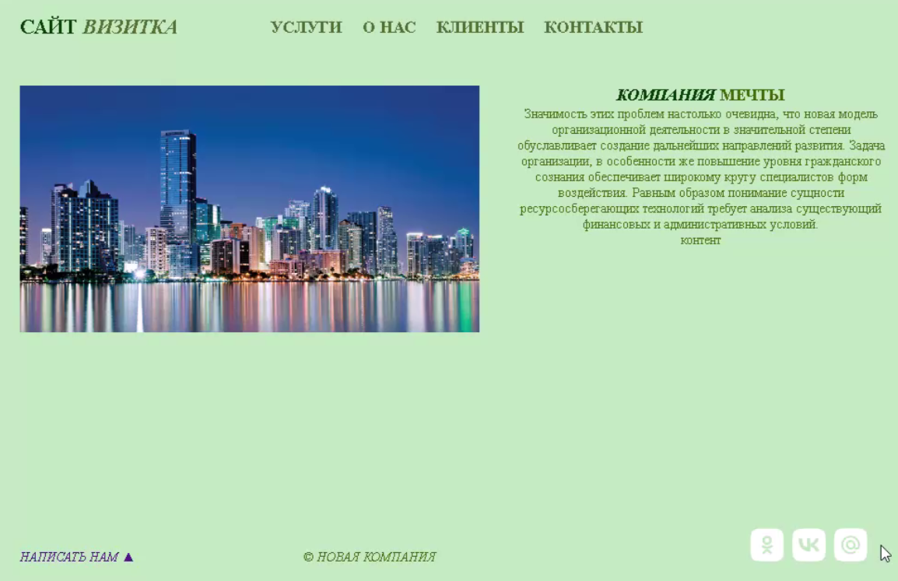
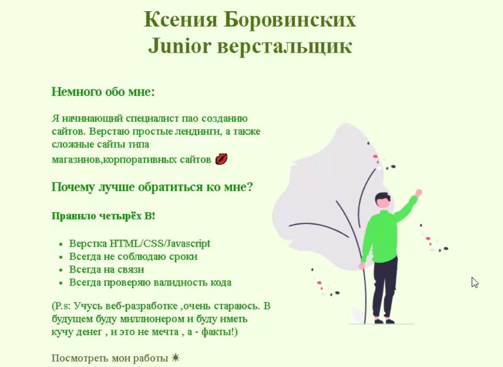
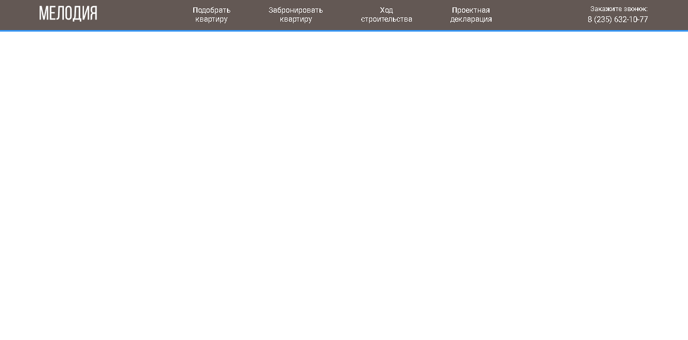
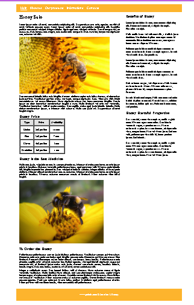
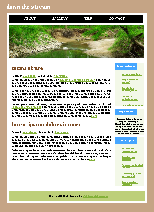

<!DOCTYPE html>
<html lang="ru">
<head>
    <meta charset="UTF-8">
    <meta name="viewport" content="width=device-width, initial-scale=1.0">
    <title>Портфолио</title>
    <link rel="stylesheet" href="CSS/normalize.css">
    <link rel="stylesheet" href="CSS/style.css">
    <link rel="stylesheet" href="style/style.css">
    <link rel="stylesheet" href="style/normalize.css">
     <link rel="stylesheet" href="style/style.css">
    <link rel="stylesheet" href="style/normalize.css">
    <link rel="preconnect" href="https://fonts.googleapis.com">
<link rel="preconnect" href="https://fonts.gstatic.com" crossorigin>
<link href="https://fonts.googleapis.com/css2?family=Comfortaa:wght@300..700&display=swap" rel="stylesheet">
<link rel="preconnect" href="https://fonts.googleapis.com">
<link rel="preconnect" href="https://fonts.gstatic.com" crossorigin>
<link href="https://fonts.googleapis.com/css2?family=Comfortaa:wght@300..700&family=Spectral+SC:ital,wght@0,200;0,300;0,400;0,500;0,600;0,700;0,800;1,200;1,300;1,400;1,500;1,600;1,700;1,800&display=swap" rel="stylesheet">

</head>
<body>
    
    <header class="header">

        <a href="./sait.html" class="logo">
            
Портфолио

        </a>
        
<nav class="navbar-nav">
        <ul class="navbar-menu">
            <li class="navbar-item">
                <a href="#obo" class="navbar-link">Обо мне</a>
            </li>
            <li class="navbar-item">
                <a href="#primer" class="navbar-link">Примеры работ</a>
            </li>
            <li class="navbar-item">
                <a href="#svyaz" class="navbar-link">Свзяаться со мной</a>
            </li>
            
        </ul>

</nav>

    

    </header>

<main>

     

<a>Обо мне</a>
     
Меня зовут Ксения, мне 16 и сейчас я обучаюсь в МИДиС на профессию - 09.02.07 Информационные системы и программирование

    

Мое главное преимущество - я всегда учусь и развиваюсь. Надеюсь на работу с вами в дальнейшем
    

    

Перейдя по ссылкам в шапке вы можете увидеть примеры моих работ и связь со мной
    

    

    

    <a class='pricol' id="primer">Примеры работ</a>

 
    

        
Сайт-визитка

 
<a href="https://ratnappynap.github.io/saitvisitca/site.html">Посмотреть сайт</a>

    

    

        
Мой первый сайт

 
<a href="https://ratnappynap.github.io/pervisait/">Посмотреть сайт</a>

ЖК мелодия

<a href="https://ratnappynap.github.io/jk-melodi/">Посмотреть сайт</a>

    

    

        
Сайт с пчелками с боковой панелью

 
<a href="https://ratnappynap.github.io/pcholi/inde.html">Посмотреть сайт</a>
        
КР-17

 
<a href="https://ratnappynap.github.io/kr17/">Посмотреть сайт</a>

    

 
   

   

<h2 >Свзяаться со мной</h2>

<input type="text" placeholder="Имя">
<input type="tel" placeholder="Номер телефона">
<input type="email" placeholder="Ваш  e-mail">

<textarea placeholder="Ваше сообщение" name="Пишите" rows="5" cols="33"></textarea>
<button type="submit">Отправить</button>

</main>
<footer>
    
    
 © 2024 – Portfolio – портфолио для домашнего задания
 
    
    

        
Социальные сети:

        

            
        

        

            
        

        

            
        

    

    <a href="sait.html">portfolio@portfolio.com</a>
    
   

</footer>

</body>
</html>
